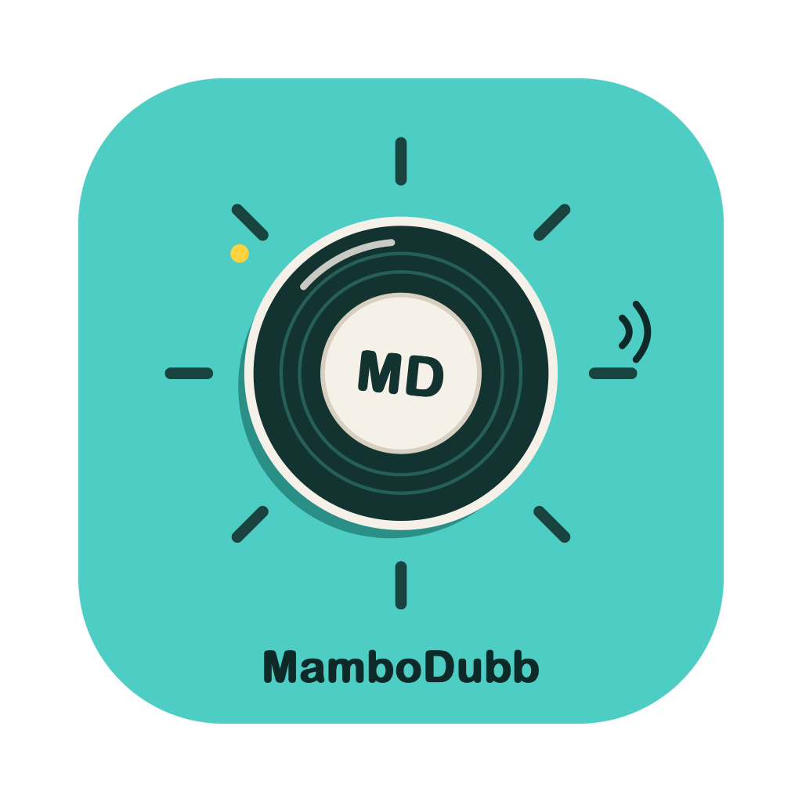

<p align="center">
  <a href="https://github.com/maxmelichov/MamboDubb/releases/latest">
    
  </a>
</p>

<h3 align="center">Dub any video into another language. Everything runs on your own machine.</h3>

<p align="center">
  <a href="https://github.com/maxmelichov/MamboDubb/releases/latest"><b>Download</b></a>
</p>

---

<!--
  An animated GIF, because a README cannot play video. GitHub renders <video>
  only from its own attachment CDN, which nothing on a command line can write
  to, so a video tag pointing at this repository draws an empty box and a link
  to an mp4 makes the reader download a file before they can see anything.
  A GIF plays where it sits, which is the only version of this that works.

  Thirteen seconds cut from the 53 second film: the tail of the Hebrew
  original, then the same speaker in English, then in Russian. No audio, so
  the dubbed line on screen is what carries it, which is also what the film is
  demonstrating. 640px and 12fps holds it under 4 MB.

  The film itself is not offered as a file anywhere. It played here as a link
  to an mp4 on the release for a while, and a link that hands somebody a
  download before they have seen anything is a worse demo than the thing
  playing in front of them. The full cut with sound lives on the site.
-->
<p align="center">
  
</p>

---

Give it a video file or a YouTube link. It transcribes, translates, speaks every line **in the original speaker's own voice**, and mixes the new speech back over the original music at the original timing. Nothing is uploaded anywhere. No account, no API key.

## Install

One command per platform. Paste it and wait.

**Mac (Apple Silicon)** gives you the desktop app in `/Applications`:

```bash
curl -fsSL https://github.com/maxmelichov/MamboDubb/releases/latest/download/install.sh | sh
```

It is the only route with no Gatekeeper dialog anywhere in it: nothing here is notarized, and `curl` is what sets no quarantine bit. The script fetches the app from the latest release, clears quarantine, ad-hoc-signs the bundle so macOS will open it, installs it, and launches it.

**Linux**, or a Mac that would rather run the server than the app, gives you the editor at `http://127.0.0.1:4400`:

```bash
curl -fsSL https://raw.githubusercontent.com/maxmelichov/MamboDubb/main/install-server.sh | sh
```

**Windows** gives you the same editor at `http://127.0.0.1:4400`:

```powershell
powershell -ExecutionPolicy Bypass -c "irm https://raw.githubusercontent.com/maxmelichov/MamboDubb/main/install-server.ps1 | iex"
```

There is no `.exe`, no `.msi`, no `.deb` and no AppImage to download, and there will not be one until GitHub Actions is re-enabled on the account that owns this repo ([docs/CROSS_PLATFORM.md](docs/CROSS_PLATFORM.md) has the details). So the two commands above are the from-source route with the work taken out of it: they fetch the source at the latest release tag with its submodule, install `uv`, resolve the Python side, put the built web UI in place, install `ffmpeg` and `sox` where they can, and start the server on port 4400. The checkout lands in `MamboDubb` in your home directory, and rerunning the command updates it.

What you get in the browser is the whole studio and not a reduced version of it: the desktop app is a thin shell over this same server, so all three commands lead to the same editor.

Then open **Setup** and press **Install everything**. That is where the models come from, about 25 GB of them, and none of it is downloaded before you press the button. It resumes where it left off if you interrupt it. The button carries the total in GB before you press it, and each row keeps its own button if you would rather take one thing at a time.

On Windows with an NVIDIA card, the installer also puts in the CUDA build of PyTorch and the CUDA libraries the speech recogniser needs, because PyPI's default wheel is CPU-only there and every model would otherwise run on the CPU. It decides by whether `nvidia-smi` is on the machine. If you sync by hand later, keep the extra on the line, because a bare sync removes what the extra brought:

```powershell
uv sync --extra app --extra cuda
uv run --extra app --extra cuda mambodubb --port 4400
```

WSL2 is the smoother path on Windows if you have it. Details: [docs/SERVER.md](docs/SERVER.md), [docs/WINDOWS.md](docs/WINDOWS.md), [docs/CROSS_PLATFORM.md](docs/CROSS_PLATFORM.md).

## What you need

| | RAM / VRAM | Disk |
|---|---|---|
| **Mac** (M-series) | 16 GB minimum, 24 GB comfortable | 25 GB |
| **NVIDIA** | 12 GB with [low-VRAM mode](docs/LOW_VRAM.md), 32 GB full | 25 GB |

A 3 minute clip takes 20 to 40 minutes. Fixing one line afterwards only re-runs that line.

## Languages

**From:** Hebrew, English, Arabic, Russian, French, Spanish, German, Italian, Portuguese, Chinese, Japanese, Korean.
**Into:** all of those except Arabic.

## The editor

Every line shows the original and the translation side by side. Edit a translation, re-voice one line, keep the original audio on another, play original vs dub back to back. Your hand edits are never overwritten.

## CLI

```bash
uv run python -m dubbing "https://www.youtube.com/watch?v=VIDEO_ID"
```

Result lands in `outputs/<run>/preview.mp4`.

## More

- [How it works and architecture](docs/APP_ARCHITECTURE.md)
- [Low-VRAM mode](docs/LOW_VRAM.md)
- [Run as a server / use from a browser](docs/SERVER.md)
- [Building the desktop app](app/desktop/README.md)

## Credits

MamboDubb is a pipeline. The intelligence is the work of the teams behind [Qwen3-TTS](https://huggingface.co/Qwen/Qwen3-TTS-12Hz-1.7B-Base) (voice cloning), [Gemma](https://huggingface.co/mlx-community/gemma-4-12B-it-6bit) (translation), [Whisper](https://github.com/SYSTRAN/faster-whisper) via [ivrit.ai](https://huggingface.co/ivrit-ai/whisper-large-v3-turbo-ct2) and deepdml (transcription), [Demucs](https://github.com/adefossez/demucs) (music separation), [pyannote](https://huggingface.co/pyannote/speaker-diarization-community-1) (speakers, CC-BY-4.0, redistributed in `third_party/`), [SpeechBrain](https://huggingface.co/speechbrain) (speaker and language ID), [Silero VAD](https://github.com/snakers4/silero-vad), and the Hebrew stack: [QwenTTS-he](https://huggingface.co/notmax123/QwenTTS-he-1.7B) + [RenikudPlus](https://github.com/maxmelichov/RenikudPlus). Full table with roles: [docs/CREDITS.md](docs/CREDITS.md).
