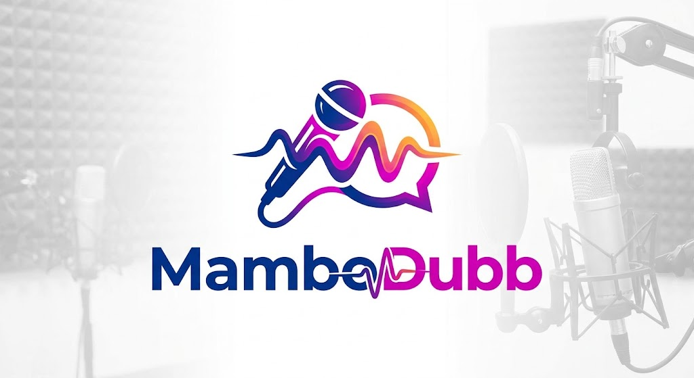

<p align="center">
  
</p>

<h3 align="center">Dub any video into another language entirely on your own machine.</h3>

<p align="center">
  <a href="https://github.com/maxmelichov/MamboDubb/releases/latest"><b>Download for Mac (Apple Silicon)</b></a>
  ·
  <a href="#quick-start-cli">Run from source</a>
  ·
  <a href="docs/WINDOWS.md">Windows</a>
  ·
  <a href="docs/APP_ARCHITECTURE.md">Architecture</a>
</p>

---

MamboDubb takes a video (a file or a YouTube link), transcribes it, translates the
transcript with context, speaks every line **in the original speaker's own voice**
using zero-shot cloning, and mixes the new speech back over the original music at the
original timing. Nothing is uploaded anywhere: every model ASR, translation,
voice synthesis, source separation, diarization runs locally.

## The app

A desktop editor built around the script, not the timeline: every line shows the
original text and its translation together. Fix a translation in place, choose per
line whether it is dubbed or keeps the original audio, re-voice a single line in
seconds, and watch the source and output waveforms side by side.

- **Script-first editing** original + translation on every row, inline edits,
  RTL-correct Hebrew alongside English.
- **Per-line control** dub / keep original, re-translate, re-voice, split, merge,
  speaker reassignment, per-segment voice options.
- **Honest state** every line says whether it is dubbed, kept, waiting, or failed,
  and one click fixes the ones that are waiting.
- **Hand edits are sacred** a corrected line is locked; no re-run ever overwrites it.
- **Compare everything** the Orig/Dub buttons play the original span and the
  dubbed take of any line, back to back.

### Install (macOS, Apple Silicon)

Grab the `.dmg` from the [latest release](https://github.com/maxmelichov/MamboDubb/releases/latest),
drag MamboDubb to Applications, and launch. The app drives the pipeline in this
checkout, so you also need the source set up once:

```bash
git clone https://github.com/maxmelichov/MamboDubb.git
cd MamboDubb
uv sync                    # Python 3.12, uv only
cp .env.example .env       # set HF_TOKEN for speaker diarization (optional)
```

> **The packaged app is Apple Silicon only** its translator runs on MLX, which
> needs an M-series chip. There is no Intel or iOS build.

### Windows and Linux

There is no installer for either, but both run the whole thing from source with
an NVIDIA GPU: translation moves from MLX to a CUDA worker in `translator/`
automatically, and everything else is unchanged.

```powershell
winget install --id astral-sh.uv -e
winget install --id Gyan.FFmpeg -e --accept-source-agreements --accept-package-agreements
winget install --id ChrisBagwell.SoX -e --accept-source-agreements --accept-package-agreements
git clone --recurse-submodules https://github.com/maxmelichov/MamboDubb.git
cd MamboDubb; uv sync
```

Windows needs one extra step — PyPI's default `torch` wheel is CPU-only there —
and has a few platform notes worth reading first: **[docs/WINDOWS.md](docs/WINDOWS.md)**.
WSL2 is the easier road if you have it, and the faster one.

## Quick start (CLI)

The whole pipeline is also a single headless command:

```bash
uv run python -m dubbing "https://www.youtube.com/watch?v=VIDEO_ID"
uv run python -m dubbing input.mp4 --duration 300        # just the first 5 minutes
```

The result lands in `outputs/<run>/preview.mp4`, next to a `report.json` that
accounts for every second of audio. Re-running is incremental finished stages are
cached and only what changed is redone.

## Run as a server (no desktop app)

The desktop app is a thin shell over a local Python server — you can run the
server directly and use the full editor in any browser:

```bash
cd app/ui && pnpm install && pnpm build && cd ../..   # build the UI once
uv run mambodubb --port 4400                          # → http://127.0.0.1:4400
```

`--outputs` picks the run directory root (default `outputs/`); pass
`--ui-dir ""` to serve the API alone.

On the default loopback bind no login is needed; requests with a non-local
`Host` header are refused (DNS-rebinding guard). Binding any other address
(`--host 0.0.0.0` for LAN use) **requires a token**: pass `--token`, or let the
server generate one — it prints a one-click `?token=…` link that sets a cookie
for the rest of the session. The traffic is plain HTTP; treat the LAN mode as
"trusted home network", not "the internet".

## Languages

| | |
|---|---|
| **Spoken language (source)** | Hebrew, English, Arabic, Russian, French, Spanish, German |
| **Dub into (target)** | English, Russian, French, Spanish, German, Italian, Portuguese, Chinese, Japanese, Korean, **Hebrew** |

Targets are bounded by what Qwen3-TTS can speak. Hebrew is not one of its ten
languages; it is added by a LoRA over the same checkpoint (one extra download —
see [docs/setup.md](docs/setup.md)), which is switched off again for the other
ten, so there is no second synthesiser and nothing about them changes. Arabic is
still source-only.

Source and target may be the same language (`--src he --tgt he`). That is a dub,
not a no-op: every line is re-voiced in the speaker's cloned voice, with no
translation step and no translator loaded.

## How it works

```
fetch → stems → transcript → segments → translate → tts → timeline → mix → report
```

One module per stage, one `manifest.json` per run as the single source of truth.
The desktop app is a thin Tauri shell over a local FastAPI server that calls the
same pipeline the app is a second front end, never a fork. The models:
faster-whisper (ASR + verification), Gemma (translation, via MLX), Qwen3-TTS
(voice cloning), Demucs (music/voice separation), Pyannote (speakers). They load
sequentially and never co-exist in memory, so 16–32 GB of unified memory is enough.

Guarantees the pipeline enforces on itself: no second of audible speech is ever
silently dropped, dubbed lines never overlap, transcription only ever listens to
the separated voice track so background music can never become invented lines,
and every synthesized take is verified by a second ASR pass before it is
accepted. Anything the pipeline could not account for is named in the run's
`report.json` instead of glossed over.

## Credits

MamboDubb is a pipeline, not a model all of the intelligence below is the work
of the teams that built and released these models openly. Full credit to them:

| Model | By | Used for |
|---|---|---|
| [Qwen3-TTS-12Hz-1.7B-Base](https://huggingface.co/Qwen/Qwen3-TTS-12Hz-1.7B-Base) | Qwen team, Alibaba Cloud | Speech synthesis + zero-shot voice cloning |
| [QwenTTS-he-1.7B](https://huggingface.co/notmax123/QwenTTS-he-1.7B) | Maxim Melichov | Hebrew LoRA over the same Qwen3-TTS checkpoint |
| [RenikudPlus](https://github.com/maxmelichov/RenikudPlus) | Maxim Melichov, Yakov Kolani, Morris Alper | Hebrew grapheme→stressed-IPA G2P feeding the Hebrew TTS |
| [Gemma 4 12B it](https://huggingface.co/mlx-community/gemma-4-12B-it-6bit) | Google DeepMind, 6-bit MLX quant by the mlx-community | Context-aware translation |
| [whisper-large-v3-turbo-ct2](https://huggingface.co/ivrit-ai/whisper-large-v3-turbo-ct2) | ivrit.ai, fine-tuning OpenAI Whisper | Hebrew transcription |
| [faster-whisper-large-v3-turbo-ct2](https://huggingface.co/deepdml/faster-whisper-large-v3-turbo-ct2) | OpenAI Whisper, CT2 conversion by deepdml | Transcription for the other source languages |
| [faster-whisper base / base.en / tiny.en](https://huggingface.co/Systran) | OpenAI Whisper, converted by SYSTRAN | Verifying every synthesized take by ear |
| [Demucs (htdemucs_ft)](https://github.com/adefossez/demucs) | Alexandre Défossez et al., Meta AI | Separating voices from music and effects |
| [speaker-diarization-community-1](https://huggingface.co/pyannote/speaker-diarization-community-1) | pyannote.audio, Hervé Bredin | Who speaks when |
| [spkrec-ecapa-voxceleb](https://huggingface.co/speechbrain/spkrec-ecapa-voxceleb) | SpeechBrain | Speaker embeddings for voice-consistent cloning |
| [lang-id-voxlingua107-ecapa](https://huggingface.co/speechbrain/lang-id-voxlingua107-ecapa) | SpeechBrain | Spoken-language identification |
| [Silero VAD](https://github.com/snakers4/silero-vad) | Silero Team | Voice activity detection |

Running on [MLX](https://github.com/ml-explore/mlx) + [mlx-lm](https://github.com/ml-explore/mlx-lm) (Apple),
[faster-whisper](https://github.com/SYSTRAN/faster-whisper) / CTranslate2, PyTorch,
[qwen-tts](https://github.com/QwenLM/Qwen3-TTS), FFmpeg, SoX and yt-dlp.

## Building the app from source

```bash
uv run scripts/build_desktop.py check   # toolchain sanity
uv run scripts/build_desktop.py build   # → app/desktop/src-tauri/target/release/bundle/
```
